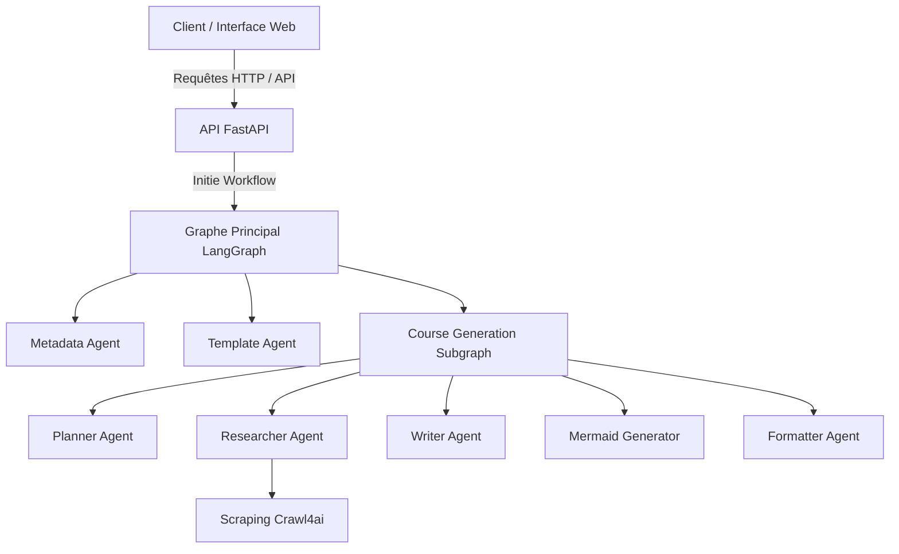
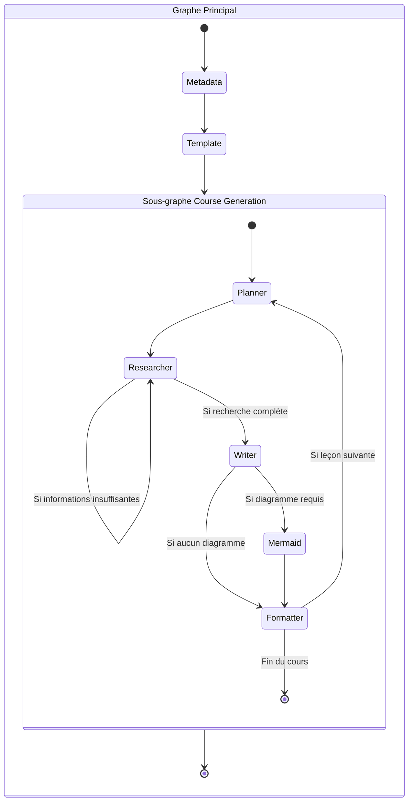
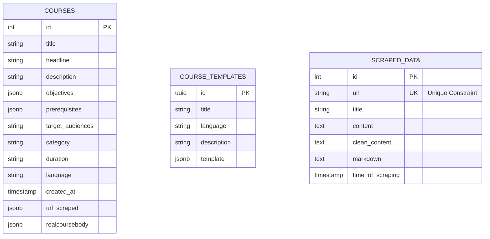

# 📚 Documentation du Projet

## 🎓 Page de garde

**Nom du projet :** Course Generation with LangGraph and Crawl4ai 🤖
**Auteur :** GHOUDDAN Khalilo 👨‍💻
**Encadrant :** AKKOH Mouhssine 👨‍🏫
**Date :** Juillet 2026 📅

---

## 📑 Table des matières
1. [Présentation du projet](#présentation-du-projet)
2. [Architecture globale](#architecture-globale)
3. [Structure du projet](#structure-du-projet)
4. [Description des agents](#description-des-agents)
5. [Workflow LangGraph](#workflow-langgraph)
6. [Base de données](#base-de-données)
7. [API](#api)
8. [Installation](#installation)
9. [Exécution](#exécution)
10. [Tests](#tests)
11. [Limitations](#limitations)
12. [Améliorations futures](#améliorations-futures)

---

## 1. 🚀 Présentation du projet

### Objectif
Le but de ce projet est d'automatiser la conception et la génération de cours de manière intelligente. En exploitant des modèles de langage avancés orchestrés par LangGraph, et en enrichissant les informations via le scraping de Crawl4ai, l'application produit des supports de cours complets, structurés et pertinents.

### Problème résolu
La création de supports pédagogiques de qualité est un processus manuel long et répétitif (recherche de sources, structuration du plan, rédaction du contenu, mise en forme). Cette application résout ce problème en automatisant entièrement ou partiellement ce workflow, offrant ainsi un gain de temps considérable pour les formateurs, professeurs et concepteurs pédagogiques.

### Technologies utilisées
- **Python** : Langage principal du backend.
- **LangGraph** : Framework de création de workflows basés sur des graphes (state graphs) pour orchestrer les agents IA avec gestion de l'état.
- **LangSmith** : Plateforme d'observabilité utilisée pour tracer, débugger et surveiller l'exécution des agents LangGraph et les appels aux LLMs en temps réel.
- **Crawl4ai** : Outil d'extraction de contenu web et de scraping pour sourcer les informations des cours.
- **FastAPI** : Framework backend asynchrone ultra-performant pour exposer le système via une API REST.
- **Docker** : Conteneurisation de l'environnement pour garantir la portabilité et simplifier les déploiements.
- **uv** : Gestionnaire d'environnement et de dépendances Python, réputé pour sa rapidité d'exécution.

---

## 2. 🏗️ Architecture globale

### Diagramme d'architecture


### Flux de données
1. L'utilisateur interagit avec le frontend ou l'API pour soumettre un sujet de cours (ex: "Introduction à la physique quantique").
2. **FastAPI** reçoit la requête, la valide et transmet les paramètres au graphe principal **LangGraph**.
3. L'agent **Metadata** analyse le sujet et définit le public, le ton et la difficulté.
4. L'agent **Template** crée un syllabus détaillé divisé en modules.
5. Le sous-graphe **Course Generation** prend le relais pour itérer sur chaque leçon du plan, en faisant collaborer les agents **Planner**, **Researcher** (avec Crawl4ai), **Writer**, **Mermaid Generator**, et **Formatter**.
6. Le résultat final est sauvegardé dans la **Base de données** et l'API renvoie le cours.

---

## 3. 📂 Structure du projet

Le code est organisé de manière modulaire pour séparer clairement les responsabilités (API, logique d'agents, accès aux données). Voici la structure détaillée :

```text
.
├── app/
│   ├── agents/      # Nœuds individuels (fonctions) constituant les agents IA
│   │   ├── course_generator/ # Sous-agents pour la rédaction (planner, researcher, writer, etc.)
│   │   ├── metadata/         # Agent de définition du contexte
│   │   ├── supervisor/       # Agent de routage optionnel
│   │   └── template/         # Agent de génération du plan
│   ├── api/         # Endpoints FastAPI exposant les fonctionnalités au monde extérieur
│   ├── db/          # Configuration de la base de données (sessions SQLAlchemy, migrations)
│   ├── graphs/      # Orchestration LangGraph : relie les agents entre eux (main_graph, course_graph)
│   ├── models/      # Modèles SQLAlchemy (ORM) et états LangGraph (ex: CourseState)
│   ├── prompts/     # Modèles de prompts injectés dans les LLMs pour guider leur comportement
│   ├── schemas/     # Validation de données entrantes/sortantes avec Pydantic
│   ├── services/    # Services externes et logique métier lourde (ex: implémentation Crawl4ai)
│   ├── tools/       # Outils spécifiques appelés par les agents (ex: recherche web)
│   └── utils/       # Fonctions utilitaires transverses (logger, helpers de formatage)
├── tests/           # Tests automatisés (unitaires et d'intégration) via pytest
├── docs/            # Fichiers de documentation du projet (incluant ce fichier)
├── scriptes/        # Scripts Bash ou Python pour le déploiement ou des tâches ponctuelles
├── .env             # Fichier de configuration des variables sensibles (API Keys)
├── docker-compose.yml # Fichier pour lancer l'infrastructure via Docker
├── pyproject.toml   # Déclaration des dépendances et de la configuration du projet
└── uv.lock          # Fichier garantissant la reproductibilité des dépendances avec `uv`
```

### Détails des dossiers principaux
- **`app/agents/` vs `app/graphs/`** : Les *agents* contiennent la logique unitaire (que fait un agent lorsqu'il est appelé). Les *graphs* contiennent la logique d'orchestration (qui appelle quel agent, et sous quelles conditions).
- **`app/models/` vs `app/schemas/`** : Les *models* interagissent avec la base de données et l'état interne de LangGraph. Les *schemas* valident les requêtes HTTP (FastAPI) pour garantir la sécurité.


---

## 4. 🤖 Description des agents

Le système repose sur un graphe principal appelant trois phases, dont la dernière est un sous-graphe complexe d'agents.

### Graphe Principal

1. **Metadata Agent** : Contextualise la demande. Il déduit les attributs clés du cours (titre, public cible, difficulté) pour s'assurer que le contenu soit adapté.
2. **Template Agent** : Construit l'ossature du cours (syllabus) sans rédiger le contenu.
3. **Course Generation (Sous-graphe)** : Gère la rédaction détaillée.

### Sous-graphe de Génération de Cours (Course Generation Agents)

Le sous-graphe orchestre la création itérative du contenu pour chaque leçon du syllabus :
- **Planner Agent** (`planner_node`) : Planifie le contenu spécifique d'une leçon.
- **Researcher Agent** (`researcher_node`) : Utilise l'outil Crawl4ai pour chercher des informations externes. Si les informations sont insuffisantes, il peut recommencer sa recherche.
- **Writer Agent** (`writer_node`) : Rédige le contenu de la leçon à partir des recherches.
- **Mermaid Generator** (`mermaid_node`) : Génère des diagrammes Mermaid si la leçon en nécessite.
- **Formatter Agent** (`formatter_node`) : Formate le texte final de la leçon.

*(Note : Un **Supervisor Agent** est également présent dans la structure pour d'éventuelles tâches de routage avancées).*

---

## 5. 🔄 Workflow LangGraph

### Diagramme du workflow


### Explication de chaque nœud
- **Metadata / Template** : Initialisent le contexte et le plan global du cours.
- **Planner** : Prépare le travail pour la leçon courante.
- **Researcher** : Effectue les recherches web avec Crawl4ai (boucle conditionnelle de recherche jusqu'à complétion).
- **Writer** : Rédige le contenu de la leçon.
- **Mermaid / Formatter** : Affinent la présentation du contenu en y ajoutant des diagrammes ou en restructurant le format final.

### Conditions de transition (Conditional Edges)
- **`should_continue_research`** : Vérifie si le *Researcher* a assez d'infos. Si non, il boucle sur lui-même. Si oui, il passe au *Writer*.
- **`needs_mermaid`** : Le *Writer* décide si un diagramme est nécessaire pour la leçon.
- **`has_more_lessons`** : Après le *Formatter*, si d'autres leçons sont présentes dans le syllabus, on retourne au *Planner*, sinon le sous-graphe se termine.

---

## 6. Modèles et Base de données

L'application s'appuie sur des **Modèles d'état (Pydantic)** pour la gestion en mémoire et sur **PostgreSQL (via psycopg2)** pour la persistance des données. **SQLAlchemy n'est pas utilisé**, les requêtes sont exécutées en SQL natif pour des performances optimales.

### 🧠 Modèles d'état et API (Pydantic)
Ces modèles valident et structurent la donnée en mémoire pendant l'exécution du graphe LangGraph.
- **`CourseState`** (`app/models/state.py`) : Le composant central du workflow. Il stocke l'état complet de la génération à chaque instant (`prompt`, `metadata`, `template`, `realcoursebody`, etc.) ainsi que les indicateurs de contrôle (`research_complete`, `has_next_lesson`).
- **Modèles d'API** (`app/models/course.py`) : `CourseRequest`, `CourseOutput` et `CourseResponse` gèrent la validation des données d'entrée/sortie de l'API.

### 🗄️ Structure de la Base de Données (PostgreSQL)

Le projet utilise 3 tables principales pour stocker les informations extraites et générées :



#### Détail des 3 Tables :

1. **`scraped_data`** (Gérée par `app/db/coursDB.py`)
   - *Rôle* : Stocke le contenu brut et nettoyé récupéré par Crawl4ai pour éviter de rescraper les mêmes pages.
   - *Champs clés* : `url` (Unique), `title`, `clean_content`, `markdown`, `time_of_scraping`.
   
2. **`courses`** (Gérée par `app/db/coursDB.py`)
   - *Rôle* : Sauvegarde les cours finaux générés par l'IA.
   - *Champs clés* : `title`, `description`, `realcoursebody` (JSON complexe contenant le contenu du cours), `url_scraped` (sources utilisées), `created_at`.
   
3. **`course_templates`** (Gérée par `app/db/templateDB.py`)
   - *Rôle* : Stocke les modèles (syllabus) prédéfinis ou générés, qui servent de plan d'action pour la rédaction.
   - *Champs clés* : `id` (UUID), `title`, `description`, `template` (Structure JSON).

---

## 7. 🔌 API

### Endpoints
Exposés via FastAPI :
- `POST /courses` : Démarre un workflow asynchrone pour générer un cours.
- `GET /courses/{id}` : Récupère l'état d'avancement d'un cours.

---

## 8. ⚙️ Installation

### Prérequis
- Python 3.10 ou supérieur.
- [uv](https://github.com/astral-sh/uv) (Package manager ultra-rapide).
- Docker (si base de données).

### Variables d'environnement
Créez un fichier `.env` à la racine :
```bash
cp .env.example .env
```
Assurez-vous de renseigner les clés API nécessaires (ex: `OPENAI_API_KEY`).

### Installation avec uv
```bash
uv venv
uv sync
```

---

## 9. ▶️ Exécution

### Exécution Locale (sans Docker)
1. **Synchroniser les dépendances** : 
   ```bash
   uv sync
   ```
2. **LangGraph Studio (Développement)** : 
   ```bash
   langgraph dev
   ```
3. **API FastAPI** : 
   ```bash
   uv run fastapi dev app/main.py
   ```
   L'API sera accessible sur : [http://localhost:8000](http://localhost:8000)
   La documentation interactive (Swagger) sur : [http://localhost:8000/docs](http://localhost:8000/docs)

### Exécution avec Docker
Si vous préférez utiliser Docker pour encapsuler l'application complète :

1. Construire et lancer les conteneurs :
   ```bash
   docker-compose up -d --build
   ```
   *(Vous pouvez aussi utiliser le script fourni : `bash start.sh`)*
2. L'API sera accessible sur : [http://localhost:8000](http://localhost:8000)
3. Pour arrêter les conteneurs :
   ```bash
   docker-compose down
   ```

---

## 10. 🧪 Tests
L'infrastructure de test repose sur `pytest` dans le dossier `tests/`.
```bash
uv run pytest
```

---

## 11. ⚠️ Limitations
- Temps d'exécution proportionnel à la taille du syllabus.
- Limites de l'API LLM (Rate Limits).

---

## 12. 🔮 Améliorations futures
- Processus Human-in-the-loop (HITL) entre la génération du plan et la rédaction.
- Export Multi-formats (PDF, Word, etc.).
- Ajout d'un "Quiz Agent".
